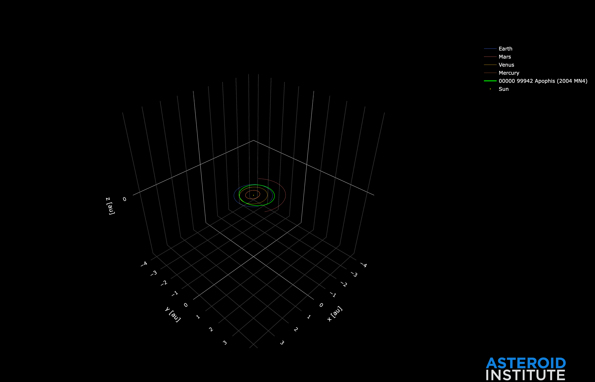

Using Orbits
============

``Orbits`` is the core state table used across propagation, ephemeris generation,
orbit determination handoff, photometry prediction, and export.

What an ``Orbits`` Row Contains
-------------------------------

Each row carries:

* ``orbit_id``: stable row identity for joins and grouping.
* ``object_id``: optional external label/designation.
* ``coordinates``: Cartesian state (position/velocity + time + origin + frame).
* ``physical_parameters``: optional H/G photometry parameters used for magnitude prediction.

Source Orbits from External Services
------------------------------------

.. code-block:: python

   from adam_core.orbits import Orbits
   from adam_core.orbits.query import query_horizons, query_neocc, query_sbdb, query_scout
   from adam_core.time import Timestamp

   sbdb_orbits: Orbits = query_sbdb(["Apophis", "Eros"])

   # Horizons requires an explicit epoch grid.
   t0: Timestamp = Timestamp.from_mjd([60200.0], scale="tdb")
   horizons_orbits: Orbits = query_horizons(["Apophis"], t0)

   neocc_orbits: Orbits = query_neocc(["2024YR4"])

   # Scout returns sampled variants; collapse to deterministic Orbits if needed.
   scout_variants = query_scout(["P10vY9r"])
   scout_orbits: Orbits = scout_variants.collapse_by_object_id()

   orbits: Orbits = sbdb_orbits
   print(len(orbits), orbits.orbit_id.to_pylist()[:2])

Normalize Multiple Sources Behind One Contract
----------------------------------------------

.. code-block:: python

   from adam_core.orbits import Orbits
   from adam_core.orbits.query import query_horizons, query_neocc, query_sbdb, query_scout
   from adam_core.time import Timestamp

   def get_orbits(source: str, object_ids: list[str]) -> Orbits:
       if source == "sbdb":
           return query_sbdb(object_ids)
       if source == "horizons":
           t0 = Timestamp.from_mjd([60200.0], scale="tdb")
           return query_horizons(object_ids, t0)
       if source == "neocc":
           return query_neocc(object_ids)
       if source == "scout":
           return query_scout(object_ids).collapse_by_object_id()
       raise ValueError(f"Unsupported source: {source}")

Construct ``Orbits`` Directly from State Vectors
------------------------------------------------

.. code-block:: python

   import numpy as np
   from adam_core.coordinates.cartesian import CartesianCoordinates
   from adam_core.coordinates.origin import Origin
   from adam_core.orbits import Orbits
   from adam_core.orbits.physical_parameters import PhysicalParameters
   from adam_core.time import Timestamp

   t: Timestamp = Timestamp.from_mjd(np.array([60200.0]), scale="tdb")
   origin: Origin = Origin.from_kwargs(code=["SUN"])

   coords: CartesianCoordinates = CartesianCoordinates.from_kwargs(
       x=[1.0],
       y=[0.1],
       z=[0.0],
       vx=[0.0],
       vy=[0.017],
       vz=[0.0],
       time=t,
       origin=origin,
       frame="ecliptic",
   )

   photometry: PhysicalParameters = PhysicalParameters.from_kwargs(
       H_v=[21.5],
       H_v_sigma=[0.3],
       G=[0.15],
       G_sigma=[0.05],
   )

   constructed_orbits: Orbits = Orbits.from_kwargs(
       orbit_id=["custom-001"],
       object_id=["demo-object"],
       coordinates=coords,
       physical_parameters=photometry,
   )

Key ``Orbits`` Methods
----------------------

.. code-block:: python

   # Group by orbit_id for per-candidate processing.
   for orbit_id, orbit_rows in constructed_orbits.group_by_orbit_id():
       print(orbit_id, len(orbit_rows))

   # Dynamical class labels from orbital elements.
   classes = constructed_orbits.dynamical_class()
   print(classes)

   # `preview` is useful for quick single-orbit visual inspection.
   # constructed_orbits.take([0]).preview(propagator)

Quick Orbit Preview
-------------------

This is the same "preview orbit" pattern, now folded into ``Using Orbits`` so
the sourcing + inspection flow is in one place.

.. code-block:: python

   from adam_assist import ASSISTPropagator
   from adam_core.orbits import Orbits
   from adam_core.orbits.query import query_sbdb

   preview_orbits: Orbits = query_sbdb(["Apophis"])
   propagator = ASSISTPropagator()

   # Render an interactive preview for one orbit.
   preview_orbits.take([0]).preview(propagator)

   Example preview output from the ``preview_orbits.take([0]).preview(...)`` workflow.

When to Use
-----------

* ``query_sbdb`` for stable catalog orbits.
* ``query_scout`` for uncertain candidate ensembles, then collapse when needed.
* ``query_horizons`` when specific epochs and Horizons consistency matter.
* ``query_neocc`` for ESA NEOCC-based ingest.
* direct ``Orbits.from_kwargs`` construction when ingesting from custom pipelines.

Related Reference
-----------------

* :doc:`../reference/api/adam_core.orbits`
* :doc:`../reference/api/modules`
