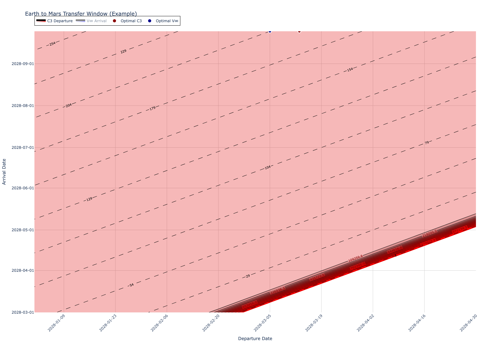

.. meta::
   :description: adam_core is the core scientific library for ADAM, providing orbit, coordinate, time, residual, photometry, and uncertainty tooling for production asteroid analysis.
   :keywords: adam_core, asteroid, orbit propagation, ephemeris, impact risk, orbit determination, planetary science

adam_core
=======================

``adam_core`` exists to provide a single, reliable scientific foundation for asteroid
analysis, astrodynamics, and solar system astronomy. It centralizes core representations
(time, coordinates, covariances, orbits, observers, residuals, and photometry) so
different applications use the same physical assumptions and data contracts. We built this library
because existing tools did not meet the precision, accuracy, or engineering performance required for
large scale analysis or scientifically critical applications like impact risk assessment.

Visual Tour
-----------

Representative outputs from real ``adam_core`` guides and examples:

.. figure:: _static/using_orbits_preview.png
   :alt: Orbit preview from the Using Orbits guide.
   :width: 100%
   :align: center

   Orbit inspection preview generated from :doc:`cookbook/orbit_sources_and_state_tables`.

   Transfer design surface from :doc:`cookbook/transfer_and_porkchop`.

.. figure:: _static/impact_risk_corridor_preview.png
   :alt: Impact risk corridor visualization from the impact probabilities guide.
   :width: 100%
   :align: center

   Earth impact corridor visualization from :doc:`cookbook/impact_probabilities`.

Engineering Standards
---------------------

* Strict quality gates in development: linting/formatting, type checking, and tests.
* Aim for machine precision when possible and benchmarked CPU/GPU performance with bounded memory usage.

Development Philosophy
----------------------

* Build small, composable scientific objects first; compose behavior from those objects.
* Prefer explicitness over hidden heuristics for frames, scales, time systems, and uncertainty handling.
* Start simple, then expose advanced controls for scale, performance, and mission-specific constraints.
* Keep domain logic close to data models so behavior remains inspectable and testable.

Documentation Map
-----------------

* ``Getting Started``: installation and environment setup.
* ``Use Cases``: all narrative and atomic capability guides in one place, from simple tasks to advanced analysis.
* ``Reference``: module-by-module API coverage and inventory.

.. toctree::
   :maxdepth: 2
   :caption: Documentation

   Getting Started <getting_started/index>
   Use Cases <use_cases/index>
   Reference <reference/index>

Indices and tables
==================

* :ref:`genindex`
* :ref:`modindex`
* :ref:`search`
