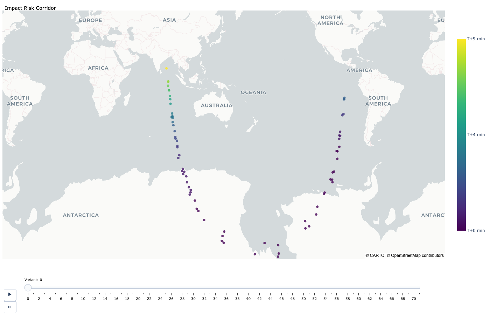

.. meta::
   :description: Impact risk analysis in adam_core using sampled variants, collision conditions, stopping behavior, impact probability summaries, and visualization products.

Impact Risk Analysis
====================

Goal
----

Estimate impact likelihood from uncertain orbits, then inspect event timing,
collision-condition behavior, and impact geography for operational
decision-making.

When to Use This Guide
----------------------

* Probabilistic impact-risk assessment from uncertain orbit solutions.
* Fast triage followed by higher-fidelity reruns for decision support.
* Scenario studies with custom collision conditions and stopping logic.

Backend Requirement
-------------------

Impact analysis requires a propagator that implements ``ImpactMixin`` collision
detection. For production use, prefer ``adam_assist.ASSISTPropagator``.

Core Pattern
------------

1. sample variants from orbit covariance
2. propagate variants while monitoring collision conditions
3. aggregate collision outcomes into cumulative probabilities

Core Objects and Their Roles
----------------------------

* ``CollisionConditions``:
  defines monitored event surfaces and termination behavior.
* ``CollisionEvent``:
  event rows returned by detection (what was hit, when, and whether that
  condition is terminal).
* ``ImpactProbabilities``:
  per-orbit, per-condition summary table with counts, probabilities, and timing
  statistics.

Collision Conditions: What They Are
-----------------------------------

Each row in ``CollisionConditions`` is one monitored boundary:

* ``condition_id``:
  label used in outputs and summaries.
* ``collision_object``:
  body code (for example ``EARTH``, ``MOON``).
* ``collision_distance``:
  radial threshold in **km** from the body center.
* ``stopping_condition``:
  whether propagation should stop for a variant after this condition is met.

Minimal explicit setup:

.. code-block:: python

   from adam_core.coordinates import Origin
   from adam_core.dynamics.impacts import CollisionConditions

   conditions: CollisionConditions = CollisionConditions.from_kwargs(
       condition_id=["Earth", "Moon"],
       collision_object=Origin.from_kwargs(code=["EARTH", "MOON"]),
       collision_distance=[6420.0, 1740.0],
       stopping_condition=[True, True],
   )

Stopping Conditions: How To Use Them
------------------------------------

``stopping_condition`` is per-condition and controls termination behavior after
that boundary is crossed:

* ``True``:
  treat this condition as terminal for a variant.
* ``False``:
  keep propagating after crossing this boundary so later events can still be
  recorded.
* mixed configurations:
  common for "terminal Earth impact, non-terminal Moon/other event tracking."

Example mixed configuration:

.. code-block:: python

   conditions: CollisionConditions = CollisionConditions.from_kwargs(
       condition_id=["Earth", "Moon"],
       collision_object=Origin.from_kwargs(code=["EARTH", "MOON"]),
       collision_distance=[6420.0, 1740.0],
       stopping_condition=[True, False],
   )

Quick Triage Example
--------------------

Use this for a first-pass estimate before a larger rerun.

.. code-block:: python

   from adam_assist import ASSISTPropagator
   from adam_core.dynamics.impacts import (
       CollisionEvent,
       ImpactProbabilities,
       calculate_impact_probabilities,
       calculate_impacts,
   )
   from adam_core.orbits import Orbits, VariantOrbits
   from adam_core.orbits.query import query_sbdb

   orbit: Orbits = query_sbdb(["2024 YR4"])
   propagator = ASSISTPropagator()

   variants: VariantOrbits
   collisions: CollisionEvent
   variants, collisions = calculate_impacts(
       orbits=orbit,
       num_days=365,
       propagator=propagator,
       num_samples=5000,
       processes=16,
       seed=42,
   )

   impact_probabilities: ImpactProbabilities = calculate_impact_probabilities(
       variants,
       collisions,
   )
   print(impact_probabilities.to_dataframe())

YR4-Style End-to-End Workflow (Expanded)
----------------------------------------

This is the full operational path with explicit analysis window and explicit
collision conditions.

.. code-block:: python

   from adam_assist import ASSISTPropagator
   from adam_core.coordinates import Origin
   from adam_core.dynamics.impacts import (
       CollisionConditions,
       CollisionEvent,
       ImpactProbabilities,
       calculate_impact_probabilities,
       calculate_impacts,
   )
   from adam_core.orbits import Orbits, VariantOrbits
   from adam_core.orbits.query import query_sbdb
   from adam_core.time import Timestamp

   orbit: Orbits = query_sbdb(["2024 YR4"])

   # Size the propagation window from an operationally relevant date.
   approx_impact_date: Timestamp = Timestamp.from_iso8601(["2032-12-22"], scale="tdb")
   analysis_end: Timestamp = approx_impact_date.add_days(30)
   days_to_run, _ = analysis_end.difference(orbit.coordinates.time)
   num_days: int = int(days_to_run[0].as_py())

   conditions: CollisionConditions = CollisionConditions.from_kwargs(
       condition_id=["Earth", "Moon"],
       collision_object=Origin.from_kwargs(code=["EARTH", "MOON"]),
       collision_distance=[6420.0, 1740.0],
       stopping_condition=[True, True],
   )

   propagator = ASSISTPropagator()

   variants: VariantOrbits
   impacts: CollisionEvent
   variants, impacts = calculate_impacts(
       orbits=orbit,
       num_days=num_days,
       propagator=propagator,
       num_samples=10000,
       processes=60,
       seed=42,
       conditions=conditions,
   )

   probabilities: ImpactProbabilities = calculate_impact_probabilities(
       variants,
       impacts,
       conditions=conditions,
   )
   print(probabilities.to_dataframe())

Inspect Event Rows and Probability Outputs
------------------------------------------

Inspect raw events before summarizing so condition behavior is clear.

.. code-block:: python

   impact_df = impacts.to_dataframe()
   print(impact_df[["orbit_id", "variant_id", "condition_id", "stopping_condition"]].head())
   print("event counts by condition:")
   print(impact_df["condition_id"].value_counts())

``ImpactProbabilities`` includes per-orbit, per-condition summaries such as:

* ``impacts`` and ``variants``
* ``cumulative_probability``
* ``mean_impact_time`` / ``stddev_impact_time``
* minimum and maximum impact times

Alternative Usage Patterns
--------------------------

1. Quick Earth-only triage:
   use default conditions and moderate ``num_samples`` for throughput.
2. Decision-grade rerun:
   increase ``num_samples`` and tighten/expand ``num_days`` around relevant windows.
3. Custom event surfaces:
   define multiple conditions with distinct ``stopping_condition`` values to encode
   mission-specific logic.
4. Bring your own variant strategy:
   generate variants explicitly with ``VariantOrbits.create(method=...)`` and call
   ``propagator.detect_collisions(...)`` directly.

.. code-block:: python

   from adam_core.orbits import Orbits, VariantOrbits

   variants_direct: VariantOrbits = VariantOrbits.create(
       orbit,
       method="sigma-point",  # or "monte-carlo"
       num_samples=5000,
       seed=11,
   )

   propagated: Orbits
   impacts_direct: CollisionEvent
   propagated, impacts_direct = propagator.detect_collisions(
       variants_direct,
       num_days=num_days,
       conditions=conditions,
       max_processes=16,
   )

Visualization Workflow
----------------------

Risk corridor map
~~~~~~~~~~~~~~~~~

Use ``plot_risk_corridor`` to visualize impact geography over time. Prefer
``map_style="carto-positron"`` for docs/CI/browser stability.

.. code-block:: python

   import plotly.graph_objects as go
   from adam_core.dynamics.plots import plot_risk_corridor

   corridor_fig: go.Figure = plot_risk_corridor(
       impacts,
       title="Risk Corridor for 2024 YR4",
       map_style="carto-positron",
   )
   corridor_fig.show()

For a deterministic static preview (docs/PR assets), snapshot a late frame
before exporting:

.. code-block:: python

   if corridor_fig.frames:
       corridor_fig.update(data=corridor_fig.frames[-1].data)
   corridor_fig.write_image(
       "impact_risk_corridor_preview.png",
       width=1400,
       height=900,
       scale=1,
   )

   Corridor preview with impacts colored by relative impact time.

Impact simulation animation
~~~~~~~~~~~~~~~~~~~~~~~~~~~

Use ``generate_impact_visualization_data`` + ``plot_impact_simulation`` to
build an Earth/Moon approach and impact sequence.

.. code-block:: python

   import plotly.graph_objects as go
   from adam_core.dynamics.plots import (
       generate_impact_visualization_data,
       plot_impact_simulation,
   )
   from adam_core.orbits import Orbits
   from adam_core.time import Timestamp

   propagation_times: Timestamp
   propagated_best_fit_orbit: Orbits
   propagated_variants: dict[str, Orbits]
   propagation_times, propagated_best_fit_orbit, propagated_variants = (
       generate_impact_visualization_data(
           orbit,
           variants,
           impacts,
           propagator,
           time_step=5.0,
           time_range=60.0,
           max_processes=8,
       )
   )

   sim_fig: go.Figure = plot_impact_simulation(
       propagation_times,
       propagated_best_fit_orbit,
       propagated_variants,
       impacts,
       title="2024 YR4 Impact Simulation",
       sample_impactors=None,
       sample_non_impactors=0.1,
       logo=False,
   )
   sim_fig.show()

   # Shareable artifact for review workflows.
   sim_fig.write_html("impact_simulation.html")

Performance and Reproducibility
-------------------------------

* ``num_samples``:
  larger sample counts increase confidence in low-probability tails.
* ``processes`` / ``max_processes``:
  primary runtime scaling controls.
* ``seed``:
  fix for reproducible Monte Carlo variant generation.
* practical approach:
  run a fast triage pass first, then rerun higher-fidelity for final products.

Related Reference
-----------------

* :doc:`../reference/api/adam_core.dynamics`
* :doc:`../reference/api/adam_core.orbits`
* :doc:`../cookbook/moid_analysis`
